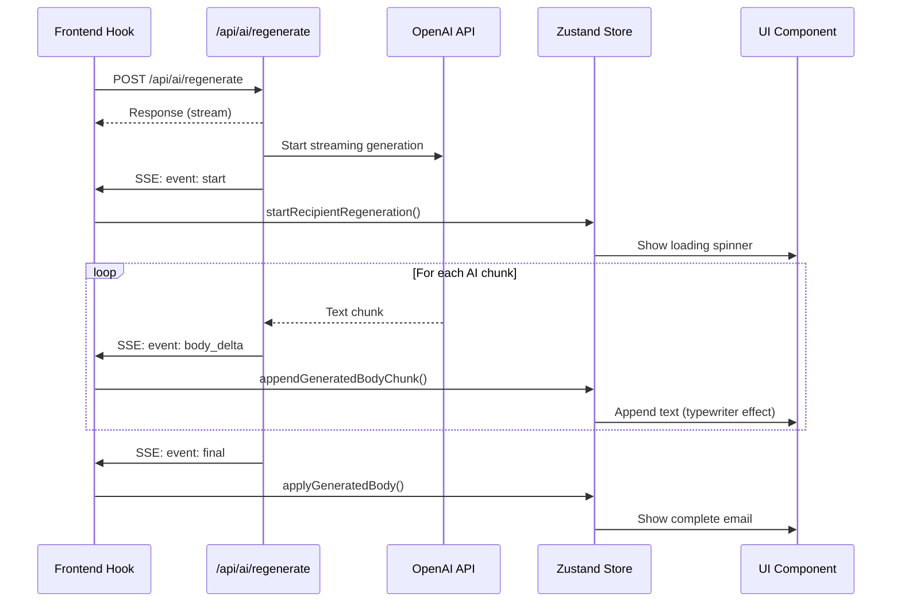

# AI Streaming Implementation

## Overview

EMAILAI uses **Server-Sent Events (SSE)** to stream AI-generated email content from the backend to the frontend in real-time, providing users with immediate visual feedback as the AI generates content.

---

## Event Flow

```
START → [body_delta, body_delta, ...] → FINAL or ERROR
```

---

## Architecture Diagram



---

## Backend Implementation

### API Route: `/api/ai/regenerate/route.ts`

**Location**: Lines 33-94

#### Creates ReadableStream with SSE Events

```typescript
const encoder = new TextEncoder();
const stream = new ReadableStream({
  async start(controller) {
    const enqueue = (chunk: string) => {
      controller.enqueue(encoder.encode(chunk));
    };

    try {
      // 1. Send START event
      enqueue(formatSseEvent({
        type: "start",
        recipientId: payload.recipientId,
      }));

      // 2. Stream AI content with BODY_DELTA events
      const parsed = await dispatchRegenerate({
        onBodyDelta: (chunk) => {
          enqueue(formatSseEvent({
            type: "body_delta",
            recipientId: payload.recipientId,
            chunk,
          }));
        },
        // ... other params
      });

      // 3. Send FINAL event
      enqueue(formatSseEvent({
        type: "final",
        recipientId: payload.recipientId,
        subject: parsed.subject?.trim(),
        body: parsed.body.trim(),
        reasoning: parsed.reasoning?.trim(),
      }));
    } catch (error) {
      // 4. Send ERROR event if something fails
      enqueue(formatSseEvent({
        type: "error",
        recipientId: payload.recipientId,
        error: error.message,
      }));
    } finally {
      controller.close();
    }
  },
});
```

#### Response Headers

```typescript
return new Response(stream, {
  headers: {
    "Content-Type": "text/event-stream; charset=utf-8",
    "Cache-Control": "no-cache, no-transform",
    "Connection": "keep-alive",
    "X-Accel-Buffering": "no",
  },
});
```

**Why these headers?**
- `text/event-stream` - Standard SSE content type
- `no-cache, no-transform` - Prevents caching and transformation
- `keep-alive` - Keeps connection open for streaming
- `X-Accel-Buffering: no` - Disables nginx buffering

---

### SSE Event Formatting

**Location**: `app/core/ai/sse.ts:14-16`

```typescript
export function formatSseEvent(event: SseEventPayload) {
  return `event: ${event.type}\ndata: ${JSON.stringify(event)}\n\n`;
}
```

#### Example Stream Output

```
event: start
data: {"type":"start","recipientId":"recipient-123"}

event: body_delta
data: {"type":"body_delta","recipientId":"recipient-123","chunk":"Hello "}

event: body_delta
data: {"type":"body_delta","recipientId":"recipient-123","chunk":"John, "}

event: body_delta
data: {"type":"body_delta","recipientId":"recipient-123","chunk":"how are you?"}

event: final
data: {"type":"final","recipientId":"recipient-123","body":"Hello John, how are you?","subject":"Updated Subject"}

```

---

### AI Provider Streaming

**Location**: `app/core/ai/providers/openai-compatible.ts:29-77`

```typescript
export async function streamWithOpenAiCompatible(
  params: AiStreamDraftParams
): Promise<AiProviderParsedResponse> {
  const client = new OpenAI({
    apiKey: params.apiKey,
    baseURL: options?.baseURL,
  });

  // Create streaming chat completion
  const stream = await client.chat.completions.create({
    model: params.model,
    stream: true,  // Enable streaming!
    messages: [
      { role: "system", content: params.systemInstruction },
      { role: "user", content: params.prompt },
    ],
  });

  let body = "";

  // Iterate through stream chunks
  for await (const chunk of stream) {
    const delta = getDeltaText(chunk.choices[0]?.delta?.content);

    if (!delta) continue;

    body += delta;

    // Callback: Send chunk to SSE stream
    await params.onBodyDelta(delta);
  }

  return { body: body.trim() };
}
```

---

## Frontend Implementation

### Custom Hook: `useRecipientRegenerate`

**Location**: `app/hooks/use-recipient-regenerate.ts:73-202`

#### Initiating the Stream

```typescript
const response = await fetch("/api/ai/regenerate", {
  method: "POST",
  headers: { "Content-Type": "application/json" },
  body: JSON.stringify({
    recipientId,
    globalSubject: campaign.globalSubject,
    globalBodyTemplate: campaign.globalBodyTemplate,
    currentBody: recipient.body,
    provider: resolvedActiveProvider.provider,
    apiKey: resolvedActiveProvider.apiKey,
    model: resolvedActiveProvider.model,
    recipient: { email: recipient.email, fields: recipient.fields },
    mode: "refresh",
  }),
});
```

#### Reading the Stream

**Location**: Lines 124-172

```typescript
const reader = response.body.getReader();
const decoder = new TextDecoder();
let buffer = "";
let completed = false;

while (true) {
  // 1. Read next chunk
  const { done, value } = await reader.read();

  // 2. Decode chunk (Uint8Array → string)
  buffer += decoder.decode(value, { stream: true });

  // 3. Split into SSE blocks (events separated by "\n\n")
  const blocks = buffer.split("\n\n");
  buffer = blocks.pop() ?? ""; // Keep incomplete block in buffer

  // 4. Process each complete block
  for (const block of blocks) {
    const event = parseSseBlock(block);

    if (!event) continue;

    switch (event.type) {
      case "start":
        startRecipientRegeneration(event.recipientId);
        break;
      case "body_delta":
        appendGeneratedBodyChunk(event.recipientId, event.chunk);
        break;
      case "final":
        completed = true;
        applyGeneratedBody({
          id: event.recipientId,
          body: event.body,
          subject: event.subject,
          reasoning: event.reasoning,
        });
        break;
      case "error":
        throw new Error(event.error);
    }
  }

  if (done) break;
}
```

#### SSE Parser

**Location**: Lines 10-55

```typescript
function parseSseBlock(block: string): RegenerateStreamEvent | null {
  const lines = block.split("\n");

  // Extract event type
  const eventLine = lines.find((line) => line.startsWith("event:"));

  // Extract data lines
  const dataLines = lines
    .filter((line) => line.startsWith("data:"))
    .map((line) => line.slice(5).trim());

  if (!eventLine || dataLines.length === 0) return null;

  const eventType = eventLine.slice(6).trim();
  const payload = JSON.parse(dataLines.join("\n"));

  return {
    type: eventType,
    recipientId: String(payload.recipientId ?? ""),
    ...(eventType === "body_delta" && { chunk: String(payload.chunk ?? "") }),
    ...(eventType === "final" && {
      body: String(payload.body ?? ""),
      subject: payload.subject,
      reasoning: payload.reasoning,
    }),
    ...(eventType === "error" && { error: String(payload.error ?? "") }),
  };
}
```

---

## Zustand Store Actions

**Location**: `app/store/campaign-store.ts`

### START Event Handler (Line 422)

```typescript
startRecipientRegeneration: (id) =>
  set((state) => {
    const existing = state.recipientsById[id];
    if (!existing) return state;

    return {
      recipientsById: {
        ...state.recipientsById,
        [id]: {
          ...existing,
          isRegenerating: true,
          generatedBody: "",  // Clear previous
          generationError: null,
        },
      },
    };
  }),
```

**Effect**: Shows loading spinner in UI

---

### BODY_DELTA Event Handler (Line 449)

```typescript
appendGeneratedBodyChunk: (id, chunk) =>
  set((state) => {
    const existing = state.recipientsById[id];
    if (!existing) return state;

    return {
      recipientsById: {
        ...state.recipientsById,
        [id]: {
          ...existing,
          generatedBody: (existing.generatedBody || "") + chunk,  // Append!
        },
      },
    };
  }),
```

**Effect**: Creates typewriter effect by appending each chunk

---

### FINAL Event Handler (Line 512)

```typescript
applyGeneratedBody: ({ id, body, subject, reasoning }) =>
  set((state) => {
    const existing = state.recipientsById[id];
    if (!existing) return state;

    return {
      recipientsById: {
        ...state.recipientsById,
        [id]: {
          ...existing,
          body,  // Replace with final body
          subject: subject ?? existing.subject,
          isRegenerating: false,
          lastGeneratedBody: body,
          generatedReasoning: reasoning,
          generatedAt: new Date().toISOString(),
          contentSource: "ai-generated",
          manualEditsSinceGenerate: false,
        },
      },
    };
  }),
```

**Effect**: Shows complete generated email

---

### ERROR Event Handler (Line 473)

```typescript
failRecipientRegeneration: ({ id, errorMessage }) =>
  set((state) => {
    const existing = state.recipientsById[id];
    if (!existing) return state;

    return {
      recipientsById: {
        ...state.recipientsById,
        [id]: {
          ...existing,
          isRegenerating: false,
          generationError: errorMessage,
        },
      },
    };
  }),
```

**Effect**: Shows error message to user

---

## Stream Event Types

**Location**: `app/types/api.ts:31-60`

```typescript
// START: Signals beginning of generation
interface RegenerateStreamStartEvent {
  type: "start";
  recipientId: string;
}

// BODY_DELTA: Streaming text chunks
interface RegenerateStreamBodyDeltaEvent {
  type: "body_delta";
  recipientId: string;
  chunk: string;  // Text fragment
}

// FINAL: Complete generated content
interface RegenerateStreamFinalEvent {
  type: "final";
  recipientId: string;
  body: string;          // Complete email body
  subject?: string;      // Optional: AI-suggested subject
  reasoning?: string;    // Optional: AI reasoning
}

// ERROR: Generation failed
interface RegenerateStreamErrorEvent {
  type: "error";
  recipientId: string;
  error: string;
}
```

---

## Complete Data Flow

```
1. USER CLICKS "REGENERATE" BUTTON
   ↓
2. useRecipientRegenerate.regenerate() called
   ↓
3. POST /api/ai/regenerate with request body
   ↓
4. Backend validates request (Zod schema)
   ↓
5. Backend creates ReadableStream
   ↓
6. Backend sends START event via SSE
   ↓
7. Frontend receives START, calls startRecipientRegeneration()
   ↓
8. UI shows loading state (spinner)
   ↓
9. Backend calls dispatchRegenerate()
   ↓
10. dispatchRegenerate() calls OpenAI SDK with stream: true
   ↓
11. OpenAI streams text chunks
   ↓
12. Loop: For each chunk
    - Backend formats as BODY_DELTA SSE event
    - Sends to frontend
    - Frontend parses event
    - Calls appendGeneratedBodyChunk()
    - UI appends text chunk (typewriter effect)
   ↓
13. OpenAI completes generation
   ↓
14. Backend sends FINAL event via SSE
   ↓
15. Frontend receives FINAL, calls applyGeneratedBody()
   ↓
16. UI shows complete generated email
   ↓
17. Backend closes stream (controller.close())
   ↓
18. Frontend exits read loop
```

---

## Key Technical Decisions

### Why Server-Sent Events (SSE)?

| Feature | SSE | WebSocket | Polling |
|---------|-----|-----------|---------|
| **Direction** | One-way (server → client) | Bi-directional | Request/response |
| **Complexity** | Low (HTTP-based) | High (protocol upgrade) | Medium |
| **Auto-reconnect** | ✅ Browser native | ❌ Manual | ❌ Manual |
| **Proxy Support** | ✅ Excellent | ⚠️ Variable | ✅ Excellent |
| **Use Case** | ✅ Streaming AI responses | ❌ Overkill | ❌ Too slow |

**We chose SSE because**:
- One-way streaming fits our use case (AI generation)
- Built-in browser support (no libraries needed)
- Automatic reconnection on network issues
- Works through proxies and firewalls
- Simpler than WebSocket for one-way communication

---

### Buffer Management Strategy

```typescript
const blocks = buffer.split("\n\n");
buffer = blocks.pop() ?? "";  // Keep incomplete block
```

**Why this approach?**
- SSE events are separated by `\n\n`
- Network chunks may split events mid-transmission
- Keep incomplete block in buffer for next iteration
- Only process complete events

---

### Stream Mode Decoding

```typescript
decoder.decode(value, { stream: true });  // Efficient
```

**Why `stream: true` mode?**
- Prevents decoder from holding entire buffer in memory
- Efficient for large responses
- Reduces memory footprint

---

### Immutable Updates

```typescript
generatedBody: existing.generatedBody + chunk  // New object
```

**Why immutable updates?**
- Ensures React only re-renders affected components
- Zustand detects changes efficiently
- Enables time-travel debugging in DevTools

---

## Error Handling

### Backend Errors

```typescript
try {
  // AI generation code
} catch (caughtError) {
  const message = caughtError instanceof Error
    ? caughtError.message
    : "AI regenerate failed.";

  // Send ERROR event
  enqueue(formatSseEvent({
    type: "error",
    recipientId: payload.recipientId,
    error: message,
  }));
} finally {
  controller.close();  // Always close stream
}
```

### Frontend Errors

```typescript
try {
  // Stream reading code
} catch (caughtError) {
  const message = caughtError instanceof Error
    ? caughtError.message
    : "AI regenerate failed.";

  // Update store with error state
  failRecipientRegeneration({
    id: recipientId,
    errorMessage: message,
  });

  setError(message);  // Local component state
}
```

### Completion Validation

```typescript
let completed = false;

// In stream loop...
case "final":
  completed = true;
  applyGeneratedBody({ ... });
  break;

// After loop
if (!completed) {
  throw new Error("AI regenerate stream ended before completion.");
}
```

**Why track completion?**
- Ensure FINAL event was received
- Detect premature stream termination
- Provide clear error messages

---

## Performance Considerations

### Concurrency
- **One stream per regeneration** - No shared state
- **Multiple recipients** - Can regenerate in parallel
- **Rate limiting** - Handled by AI provider

### Memory Management
- Stream mode decoding prevents holding entire buffer
- Efficient for large AI responses
- Proper cleanup in `finally` blocks

### React Rendering
- Immutable updates ensure React only re-renders affected components
- Zustand's merge mode prevents unnecessary re-renders
- Typewriter effect looks smooth with minimal re-renders

---

## Key Files Reference

| File | Lines | Purpose |
|------|-------|----------|
| `app/api/ai/regenerate/route.ts` | 14-116 | Backend API route, creates SSE stream |
| `app/core/ai/sse.ts` | 14-16 | SSE event formatting utility |
| `app/core/ai/providers/openai-compatible.ts` | 29-77 | OpenAI streaming implementation |
| `app/hooks/use-recipient-regenerate.ts` | 10-209 | Frontend hook, consumes SSE stream |
| `app/store/campaign-store.ts` | 422-554 | Zustand store actions for stream events |
| `app/types/api.ts` | 31-60 | TypeScript event type definitions |

---

## Summary

The EMAILAI streaming implementation provides:

✅ **Real-time feedback** - Users see AI generation as it happens
✅ **Better UX** - Typewriter effect, no waiting for complete response
✅ **Efficient** - Uses native browser APIs (ReadableStream)
✅ **Reliable** - Built-in error handling and automatic reconnection
✅ **Scalable** - One stream per regeneration, no shared state
✅ **Simple** - SSE over HTTP, no WebSocket complexity

### Event Flow Summary

```
START → [BODY_DELTA, BODY_DELTA, ...] → FINAL or ERROR
```

Each event updates the Zustand store, triggering React re-renders and showing real-time progress to the user.
